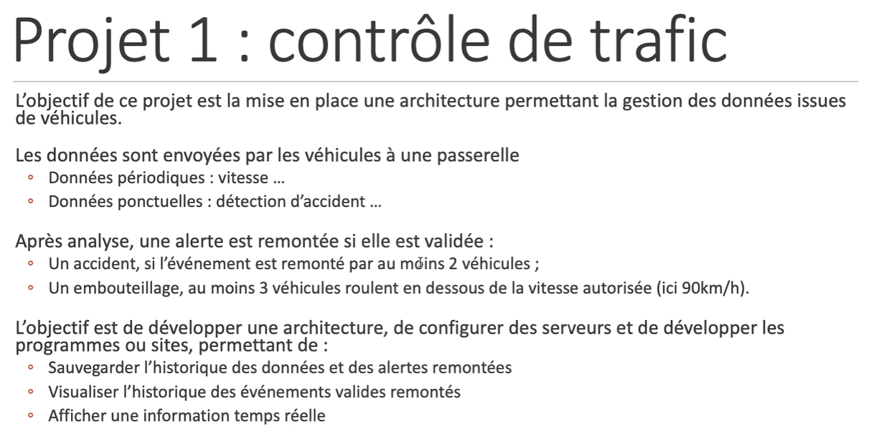

# Munin

Projet IOT CNAM Janvier 2023

## Sujet 


Pour plus de précision voir __doc/Mineur IOT - Rapport d'analyse - Projet 1 - Omar OUHBAD et Mohamed-Ali BENZINA.pdf__

## Deploiement

Instruction pour deployer sur une machine virtuelle remotlabz.

Installation de docket et git

```bash
  sudo install.sh
```

Construction et Deploiement des containers docker

```bash
  sudo docker compose up
```

L'installation du conteneur de base de données prend plusieurs minutes.


Une fois les conteneurs demarres, il faut relancer d'abord le conteneur de la borne d'acheminement.

```bash
  sudo docker container restart munin-borne-1
```

Et ensuite relancer le conteneur du Centre De Controle

```bash
  sudo docker container restart munin-cdc-1
```

Ainsi les donnees seront recuperes par le CDC dans le broker et inscrit en base.